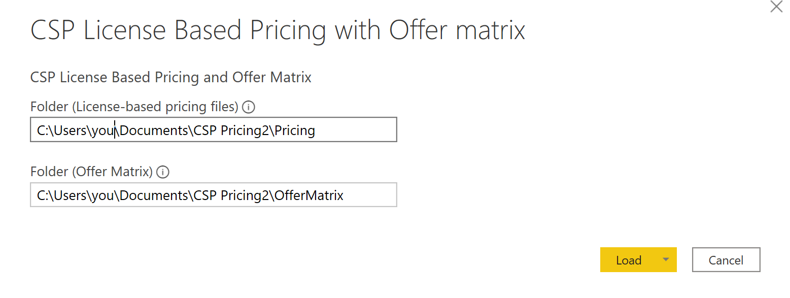

# Requirements

-Power BI desktop (if you don't have the latest version, you may be prompted that "Report layout differences might exist" when loading.  You can close the prompt and you shouldn't have any issues as long as you are on a fairly recent version)

-Access to the License-Based CSP files from Partner Center.

-Access to the Offer Matrix file from Partner Center.

-If you want to publish and share your report internally, you'll need Power BI Pro or Premium, as will the users you want to share with. <b>(DO NOT PUBLISH EXTERNALLY)</b>

-Currently the template is set up for US pricing and offer matrix.  Future versions will allow for multiple countries.  If you want to change the contry before that, pleas reach out for instructions. 

# Configuration

1. Download all of the License-based CSP files you want in the report from Partner Center and place them in a folder (only keep 1 file for each month in the folder).  When you add a new monthly file, copy it to the folder and then Refresh the Power BI report.  e.g.: C:\Users\you\OneDrive - Microsoft\Documents\CSP Pricing Report\Pricing Files\

2. Download the Offer Matrix file from Partner Center and put it in a different folder from the License-based files (you should never have more than 1 Offer Matrix file in this folder.  When you download a new one into the folder, delete the old one and then Refresh the report)  e.g.: C:\Users\you\OneDrive - Microsoft\Documents\CSP Pricing Report\Offer Matrix\

3. Open the Power BI Template in Power BI Desktop.  Upon launch, you will be prompted to enter the following: 
 <b>Folder(License-based pricing files)</b> -  Enter the path to the folder where you saved License-based pricing files in step 1
 <b>Folder(Offer Matrix)</b> -  Enter the path to the folder where you saved the Offer Matrix file in step 2 
 <b>Click Load</b>

      
4. Save the report.

5. When you load the report in the future, use the file you just saved (Power BI deskop file), instead of the template.

6. If you have Power BI Pro or Premuim,  you can publish the report for internal use and share if you'd like. <b>(DO NOT PUBLISH EXTERNALLY)</b>

# Contributing

This project welcomes contributions and suggestions.  Most contributions require you to agree to a
Contributor License Agreement (CLA) declaring that you have the right to, and actually do, grant us
the rights to use your contribution. For details, visit https://cla.opensource.microsoft.com.

When you submit a pull request, a CLA bot will automatically determine whether you need to provide
a CLA and decorate the PR appropriately (e.g., status check, comment). Simply follow the instructions
provided by the bot. You will only need to do this once across all repos using our CLA.

This project has adopted the [Microsoft Open Source Code of Conduct](https://opensource.microsoft.com/codeofconduct/).
For more information see the [Code of Conduct FAQ](https://opensource.microsoft.com/codeofconduct/faq/) or
contact [opencode@microsoft.com](mailto:opencode@microsoft.com) with any additional questions or comments.

## Data/Telemetry

This project collects usage data and sends it to Microsoft to help improve our products and services. Read our [privacy statement](http://go.microsoft.com/fwlink/?LinkId=521839) to learn more.

### Disable telemetry collection within Power BI Desktop

Disable telemetry, within Power BI Desktop, do the following.

1. Select **File** > **Options and settings** > **Options**.

2. Within the **Options** dialog, select **Usage Data** and then uncheck **Help improve Power BI Desktop by sending usage information to Microsoft**.

3. Select **Ok**.
